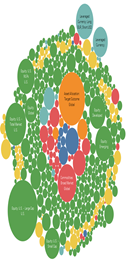

# Datavisualiztion_SKKU

_Brief description about the dataset_

- How big is your dataset ?
- What is the type of your dataset (dataset type)? 
- What are the types and semantics of the data in your dataset (data type)?
- What is the type and semantics of each attribute?
- For each nominal or ordinal attribute, list its type (nominal or ordinal) and ordering direction, all possible values (levels), and their meaning.
- For each quantitative attribute, list its type (interval or ratio) and ordering direction, range, and meaning.
- Separate the attributes into keys and values.

## Abstraction result
✨ Dataset type : Financial Data

✨DATAINFO

✨DISCRIPTION

✨DATATYPE

✨DATAVIEWER

Why do you want to perform each task?
-	Finding reasons for popular ETF products
What is the possible outcome of each task?
-	1. AUM 와 Expense Ratio 의 SIZE에 따른 Grade 
-	2. Category와 날짜별 AUM size 증감 비교
-	3. Asset Class와 등급별 Risk 
Abstract each task using a pair of action + target 
-	1.Grade&(AUM,Expense Ratio) 2. Date&Trade (Category) 3. Grade&Asset Class(Fund Closure Risk)

